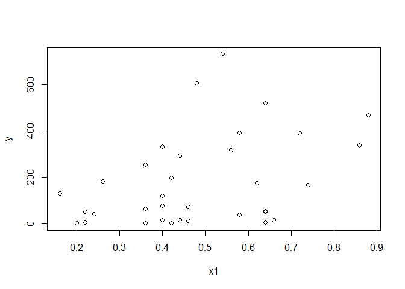
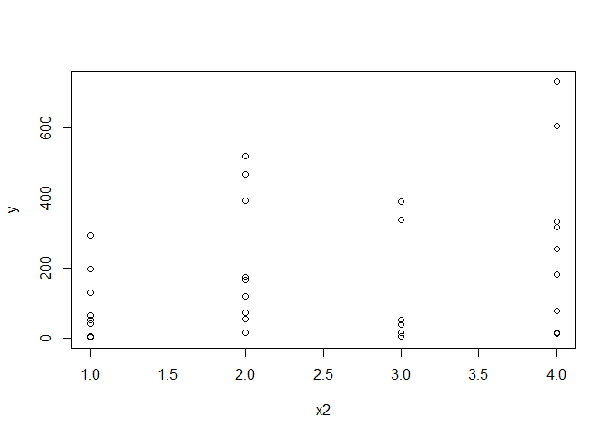
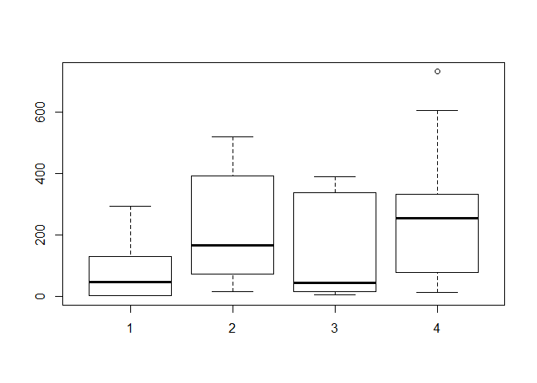
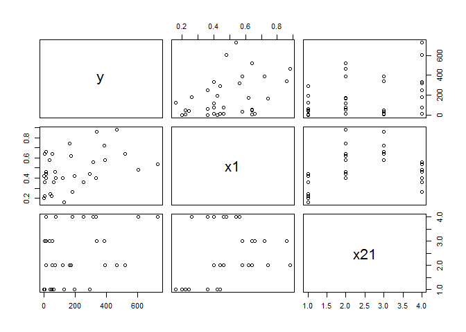
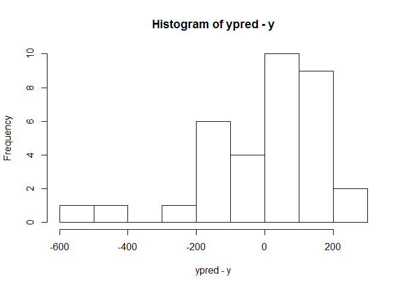

Untitled
================

GitHub Documents
----------------

This is an R Markdown format used for publishing markdown documents to GitHub. When you click the **Knit** button all R code chunks are run and a markdown file (.md) suitable for publishing to GitHub is generated.

Including Code
--------------

You can include R code in the document as follows:

``` r
x1=c(0.56,0.4,0.42,0.42,0.58,0.64,0.2,0.4,0.74,0.72,0.46,0.54,0.64,0.24,0.64,0.22,0.36,0.4,0.88,0.46,0.36,0.86,0.26,0.36,0.44,0.62,0.44,0.66,0.22,0.48,0.58,0.16,0.64,0.4)
x2=c(4,2,1,1,3,2,1,4,2,3,4,4,2,1,3,1,4,4,2,2,1,3,4,1,1,2,2,3,1,4,2,1,3,4)
x21=as.factor(x2)
y=c(317,120,197,2,37,518,1,333,166,388,13,731,54,42,52,4,253,78,466,73,3,338,181,64,294,174,15,15,50,606,391,128,5,16)
```

Plots
-----



Model 1
-------

Including a numerical variable x1. Observe that predicted values from the estimated regression equation is provided by the option "fitted.values"

``` r
fi=glm(y~x1,family=poisson(link = "log"))
summary(fi)
```

    ## 
    ## Call:
    ## glm(formula = y ~ x1, family = poisson(link = "log"))
    ## 
    ## Deviance Residuals: 
    ##     Min       1Q   Median       3Q      Max  
    ## -20.558  -13.970   -5.187    6.877   29.948  
    ## 
    ## Coefficients:
    ##             Estimate Std. Error z value Pr(>|z|)    
    ## (Intercept)  4.03295    0.04055   99.46   <2e-16 ***
    ## x1           2.23291    0.06897   32.37   <2e-16 ***
    ## ---
    ## Signif. codes:  0 '***' 0.001 '**' 0.01 '*' 0.05 '.' 0.1 ' ' 1
    ## 
    ## (Dispersion parameter for poisson family taken to be 1)
    ## 
    ##     Null deviance: 6728.7  on 33  degrees of freedom
    ## Residual deviance: 5687.0  on 32  degrees of freedom
    ## AIC: 5897.8
    ## 
    ## Number of Fisher Scoring iterations: 5

``` r
fi$coefficients
```

    ## (Intercept)          x1 
    ##    4.032947    2.232907

``` r
ypred=exp(fi$coefficients[1]+fi$coefficients[2]*x1)
hist(ypred-y)
```



``` r
summary(ypred)
```

    ##    Min. 1st Qu.  Median    Mean 3rd Qu.    Max. 
    ##   80.66  129.01  154.16  180.15  233.00  402.58

``` r
summary(fi$fitted.values)
```

    ##    Min. 1st Qu.  Median    Mean 3rd Qu.    Max. 
    ##   80.66  129.01  154.16  180.15  233.00  402.58

We try to visualise the changes in rate while a change is made in the predictor (numeric). Compare with original estimated regression parameter from coefficients

``` r
fi$coefficients[1]+fi$coefficients[2]*(x1+0.01)-(fi$coefficients[1]+fi$coefficients[2]*x1)
```

    ##  [1] 0.02232907 0.02232907 0.02232907 0.02232907 0.02232907 0.02232907
    ##  [7] 0.02232907 0.02232907 0.02232907 0.02232907 0.02232907 0.02232907
    ## [13] 0.02232907 0.02232907 0.02232907 0.02232907 0.02232907 0.02232907
    ## [19] 0.02232907 0.02232907 0.02232907 0.02232907 0.02232907 0.02232907
    ## [25] 0.02232907 0.02232907 0.02232907 0.02232907 0.02232907 0.02232907
    ## [31] 0.02232907 0.02232907 0.02232907 0.02232907

``` r
cbind(fi$coefficients[2],fi$coefficients[2]*0.01)
```

    ##        [,1]       [,2]
    ## x1 2.232907 0.02232907
