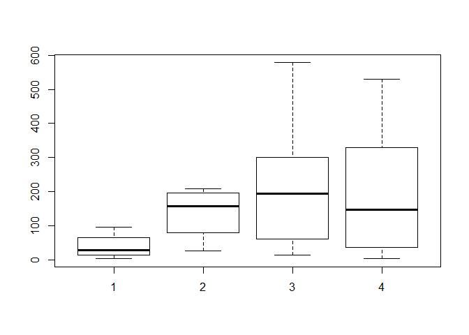

Untitled
================

GitHub Documents
----------------

This is an R Markdown format used for publishing markdown documents to GitHub. When you click the **Knit** button all R code chunks are run and a markdown file (.md) suitable for publishing to GitHub is generated.

Including Code
--------------

You can include R code in the document as follows:

``` r
bk=read.csv("C:/Users/Lapilluz2/Documents/R_CODES_RAJESHWARAN/Stan_13JAN/MA_POIS_ZIP/zip/DATA/hour.csv",header=TRUE)
head(bk)
```

    ##   instant     dteday season yr mnth hr holiday weekday workingday
    ## 1       1 01-01-2011      1  0    1  0       0       6          0
    ## 2       2 01-01-2011      1  0    1  1       0       6          0
    ## 3       3 01-01-2011      1  0    1  2       0       6          0
    ## 4       4 01-01-2011      1  0    1  3       0       6          0
    ## 5       5 01-01-2011      1  0    1  4       0       6          0
    ## 6       6 01-01-2011      1  0    1  5       0       6          0
    ##   weathersit temp  atemp  hum windspeed casual registered cnt
    ## 1          1 0.24 0.2879 0.81    0.0000      3         13  16
    ## 2          1 0.22 0.2727 0.80    0.0000      8         32  40
    ## 3          1 0.22 0.2727 0.80    0.0000      5         27  32
    ## 4          1 0.24 0.2879 0.75    0.0000      3         10  13
    ## 5          1 0.24 0.2879 0.75    0.0000      0          1   1
    ## 6          2 0.24 0.2576 0.75    0.0896      0          1   1

``` r
bk1=sample(bk$instant,size=floor(0.002*length(bk$cnt)), replace = FALSE)
bk2=bk[bk1[],]
bk2$seas=as.factor(bk2$season)
plot(bk2$seas,bk2$cnt)
```



Including Plots
---------------

You can also embed plots, for example:


Note that the `echo = FALSE` parameter was added to the code chunk to prevent printing of the R code that generated the plot.
